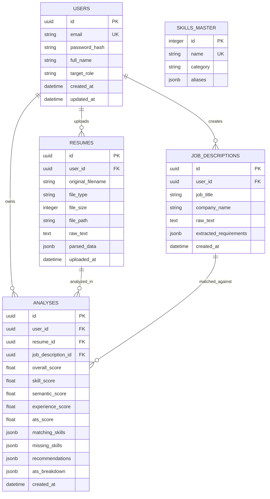

# HireLens — AI-Powered Resume Analyzer & Job Matcher
## Comprehensive Software Requirements, Architecture, & Technical Implementation Plan

---

## 1. Product Overview

**HireLens** is a full-stack, AI-powered web application designed to bridge the gap between job seekers and Applicant Tracking Systems (ATS). It allows students, fresh graduates, and entry-level professionals to upload their resumes, input target job descriptions, and receive a comprehensive, transparent, and explainable analysis.

Unlike opaque black-box AI tools, HireLens uses a hybrid deterministic and NLP-driven matching engine. It breaks down compatibility into clear, quantifiable metrics: skill match percentage, semantic textual similarity, experience/education alignment, and ATS structural health. Furthermore, HireLens delivers actionable feedback, highlighting skill gaps, keyword recommendations, and tailored suggestions to optimize the candidate's application strategy.

---

## 2. Problem Statement

Entry-level candidates faces three major challenges during job applications:
1. **The ATS Black Box**: Candidates submit resumes online without understanding why they are rejected or filtered out before human review.
2. **Skill Mismatch & Ambiguity**: Job descriptions list numerous requirements, making it difficult for candidates to evaluate if their skills align with the core requirements or how to prioritize missing skills.
3. **Lack of Explainability in Existing AI Tools**: Existing AI resume tools often output arbitrary scores without explaining the exact methodology or breakdown behind the numbers, making it impossible to defend or learn from the results.

**HireLens Solution**:
HireLens solves these problems by providing an open, mathematical, and explainable evaluation framework. It parses resumes and job postings into structured formats, runs tokenized skill extraction, computes vector cosine similarity, checks ATS format guidelines, and generates a visual breakdown of matching vs. missing skills with personalized recommendations.

---

## 3. Target Users & Job Roles

### Primary User Persona
* **Target Audience**: College students (especially 7th/8th semester Computer Engineering / Computer Science students), recent graduates, and entry-level job seekers.
* **Technical Background**: Novice to intermediate users seeking clarity on tech industry requirements.

### Supported Initial Job Roles (Extensible Architecture)
1. **Software Developer / Engineer**
2. **Backend Developer** (Python / Java / Node.js)
3. **Frontend Developer** (React / JavaScript / Web)
4. **Full Stack Developer**
5. **Python Developer**
6. **Java Developer**
7. **Data Analyst**
8. **ML / AI Engineer**

*Note: The taxonomy and matching engine are built dynamically so new roles can be registered without altering core matching logic.*

---

## 4. Functional Requirements

### FR-1: Authentication & User Management
* **FR-1.1**: User registration with Name, Email, Password, and target role preference.
* **FR-1.2**: Secure user login generating JWT tokens for authenticated sessions.
* **FR-1.3**: Password encryption using industry-standard hashing (`bcrypt`).
* **FR-1.4**: Protected API routes ensuring strict user data isolation.
* **FR-1.5**: Logout and session invalidation on client-side.

### FR-2: Resume Management & Parsing
* **FR-2.1**: Support upload of PDF (`.pdf`) and Microsoft Word (`.docx`) files.
* **FR-2.2**: Strict file validation (file type verification, MIME type checking, size cap <= 5MB).
* **FR-2.3**: Automated text extraction handling multi-column formats and standard section headers.
* **FR-2.4**: Structured parsing into canonical fields:
  * Contact Info (Email, Phone, LinkedIn, GitHub)
  * Summary / Objective
  * Skills (Technical, Soft Skills, Tools, Frameworks)
  * Work Experience & Internships (Role, Company, Dates, Bullet points)
  * Education (Degree, Major, Institution, Graduation Year, GPA/Percentage)
  * Projects (Title, Description, Tech Stack)
  * Certifications

### FR-3: Job Description (JD) Processing
* **FR-3.1**: Text area input for pasting full job descriptions or manual field inputs.
* **FR-3.2**: Automatic extraction of Job Title, Required Skills, Preferred Skills, Experience Requirements (Years), Education Requirements, and Domain Keywords.

### FR-4: Matching & Analysis Engine
* **FR-4.1**: Compute a overall **Match Score (0–100%)** based on an explainable weighted multi-factor formula.
* **FR-4.2**: **Skill Overlap Analysis**:
  * Exact Matches (Skills present in both Resume and JD)
  * Missing Required Skills (High Priority)
  * Missing Preferred Skills (Medium Priority)
  * Partial Matches / Synonyms (e.g., `React.js` vs `React`, `Postgres` vs `PostgreSQL`)
* **FR-4.3**: **Semantic Similarity Score**: Calculate cosine similarity using TF-IDF / vector embeddings between resume context and job context.
* **FR-4.4**: **Experience & Education Check**: Verify candidate experience level and degree requirements against job expectations.

### FR-5: ATS Quality Check
* **FR-5.1**: Evaluate ATS structural compliance:
  * Section Completeness (Presence of standard sections: Contact, Experience, Skills, Education, Projects)
  * Action Verb Density (Use of strong verbs like *developed, engineered, scaled, optimized*)
  * Resume Length & Formatting Heuristics (Word count, bullet density, text extractability)
  * Quantifiable Impact (Presence of metrics like percentages, numbers, time saved)

### FR-6: Recommendations & Role Suggestion
* **FR-6.1**: Provide actionable, tailored improvement recommendations (e.g., "Add 2+ quantifiable metrics in project bullet points", "Include missing core skill: Docker").
* **FR-6.2**: Suggest alternative suitable job roles from the candidate’s extracted skill profile.

### FR-7: Dashboard & Analysis History
* **FR-7.1**: Interactive results dashboard displaying visual score charts, skill breakdown badges, ATS health gauges, and suggestion cards.
* **FR-7.2**: Save analysis results linked to the user account.
* **FR-7.3**: View past analysis history and compare progression over time.
* **FR-7.4**: PDF export / downloadable report of the full analysis result.

---

## 5. Non-Functional Requirements

* **NFR-1: Performance**: Resume parsing and matching score computation must complete within **< 3 seconds** per request under normal load.
* **NFR-2: Explainability**: Every score displayed must have an explicit sub-score breakdown visible to the user (Skill Match, Semantic Match, Experience Alignment, ATS Quality).
* **NFR-3: Security**: Passwords must never be stored in plain text. JWT tokens must expire after 24 hours. API inputs must be sanitized against SQL Injection, XSS, and Path Traversal.
* **NFR-4: Scalability**: Stateless API architecture allowing independent scaling of backend service and database.
* **NFR-5: Reliability & Robustness**: Malformed or unparseable resumes must return graceful error messages without crashing the backend service.
* **NFR-6: Usability & Aesthetics**: Modern, clean, responsive dark/light UI built with consistent typography, micro-interactions, visual charts, and high visual appeal suitable for showcase.

---

## 6. User Flow

```
[ Landing Page ]
       │
       ▼
[ Register / Login ] ──(JWT Token Issued)──► [ User Dashboard ]
                                                    │
                                                    ▼
                                          [ Upload Resume (.pdf/.docx) ]
                                                    │
                                                    ▼
                                          [ Paste Job Description ]
                                                    │
                                                    ▼
                                           [ Click "Analyze" ]
                                                    │
                                                    ▼
                                        [ Processing Pipeline ]
                                    (Parsing -> Extracting -> Matching)
                                                    │
                                                    ▼
                                       [ Analysis Results Dashboard ]
      ┌─────────────────────────────────────────────┼─────────────────────────────────────────────┐
      ▼                                             ▼                                             ▼
[ Overall Match Score ]                   [ Skill Gap Analysis ]                        [ ATS Health & Feedback ]
 (Weighted Formula)                     (Matching vs Missing Skills)                     (Action Verbs, Sections)
      │                                             │                                             │
      └─────────────────────────────────────────────┼─────────────────────────────────────────────┘
                                                    │
                                                    ▼
                                       [ Save to History & Export PDF ]
```

---

## 7. Feature List

| Feature Module | Features Included | Priority |
| :--- | :--- | :--- |
| **Auth** | User Registration, User Login, JWT Auth, Protected Routes, User Profile | High (P0) |
| **Resume Parser** | File Upload (PDF/DOCX), Text Extraction, Section Segmentation, Skill/Entity Extraction | High (P0) |
| **JD Parser** | Text Processing, Requirement Parsing, Skill & Keyword Extraction | High (P0) |
| **Matching Engine** | Skill Jaccard Match, TF-IDF Cosine Similarity, Experience Matcher, Weighted Composite Scoring | High (P0) |
| **ATS Analyzer** | Section Health Check, Action Verbs Analyzer, Metrics/Quantifiable Impact Checker | High (P0) |
| **Dashboard** | Score Gauges, Skill Badges, Gap Matrix, Improvement Suggestions List | High (P0) |
| **History** | Save Analysis Record, View Past Analyses List, Load Detailed Past Analysis | Medium (P1) |
| **Recommendations** | Role Recommendations, Missing Skill Prioritization | Medium (P1) |
| **Export** | Generate Downloadable PDF Analysis Report | Low (P2) |

---

## 8. Technology Stack Selection & Evaluation

To ensure this project serves as an exceptional flagship portfolio piece for placement interviews, we evaluate technology alternatives based on: **Industry Relevance**, **Developer Productivity**, **Explainability**, and **Interview Discussion Value**.

### 8.1 Backend Framework Evaluation

| Option | Pros | Cons | Recommendation |
| :--- | :--- | :--- | :--- |
| **FastAPI (Python)** | High performance (async), automatic OpenAPI docs, native Python data science/NLP ecosystem, Pydantic type safety. | Requires understanding async/await in Python. | **RECOMMENDED** |
| **Flask (Python)** | Simple, lightweight, flexible. | Requires manual setup for validation, async, and Swagger docs; less structured. | Alternative |
| **Node.js (Express)** | Fast I/O, single language (JS/TS) full-stack. | Inferior ecosystem for NLP, text mining, vector similarity compared to Python. | Not Recommended |
| **Django (Python)** | Batteries-included, built-in ORM/Auth. | Heavyweight for stateless REST API + NLP processing pipeline; monolithic overhead. | Not Recommended |

*Decision*: **FastAPI (Python 3.11+)**
*Why*: Native integration with Python NLP libraries (spaCy, scikit-learn, PyPDF2/python-docx), async speed, Pydantic data validation, and clean RESTful modular routing via `APIRouter`.

---

### 8.2 Frontend Framework Evaluation

| Option | Pros | Cons | Recommendation |
| :--- | :--- | :--- | :--- |
| **React (Vite)** | Industry standard, component-based, rich ecosystem (Recharts, Lucide icons, Tailwind), highly valued in interviews. | Requires state management planning. | **RECOMMENDED** |
| **Vanilla HTML/JS** | Zero build step, simple. | Difficult to manage complex dashboard state, charts, file upload progress, and dynamic components. | Not Recommended |
| **Next.js** | Full-stack SSR, file-system routing. | Adds server-side rendering complexity unnecessary for a client dashboard talking to a FastAPI backend. | Not Recommended |

*Decision*: **React 18 + Vite + Tailwind CSS + Lucide Icons + Recharts**
*Why*: Fast HMR development with Vite, clean component UI with Tailwind, visual charts using Recharts, and clear client-side state management.

---

### 8.3 Database Evaluation

| Option | Pros | Cons | Recommendation |
| :--- | :--- | :--- | :--- |
| **PostgreSQL** | Robust relational database, ACID compliant, native JSONB support for semi-structured parsed data, widely used in enterprise. | Requires local/hosted server setup. | **RECOMMENDED** |
| **SQLite** | Zero setup, file-based database, great for initial local dev and unit testing. | Limited concurrency, lacks production backend feel. | **Dev / Testing** |
| **MongoDB** | Schema-less document storage. | Harder to demonstrate traditional SQL relational database design, joins, and foreign keys in interviews. | Not Recommended |

*Decision*: **PostgreSQL (with SQLite fallback for instant setup/testing)** managed via **SQLAlchemy ORM** and **Alembic migrations**.

---

### 8.4 NLP & Machine Learning Engine Evaluation

| Option | Pros | Cons | Recommendation |
| :--- | :--- | :--- | :--- |
| **Hybrid Pipeline (spaCy + TF-IDF + Custom Tokenizer + Deterministic Scoring)** | 100% explainable, deterministic, fast (<1s), zero API cost, offline execution, easy to explain step-by-step math in interviews. | Requires well-crafted regex and taxonomy patterns. | **RECOMMENDED CORE** |
| **Pure LLM API (OpenAI GPT-4 / Gemini API)** | Low initial code effort, natural language summary. | Non-deterministic "black box" scores, API cost, latency (3-10s), rate limits, zero algorithmic complexity to showcase. | **Optional Feedback Enhancement** |

*Decision*: **Hybrid Engine (Primary: spaCy + scikit-learn TF-IDF + Regex Taxonomy Engine; Secondary: Optional API for Qualitative Summary)**
*Why*: Allows the student to explain vector space models, cosine similarity, Jaccard index, TF-IDF, and regex NER during interviews instead of just saying "I called an LLM API."

---

## 9. System Architecture

 HireLens follows a **Modular Clean Layered Architecture**:

```
 ┌────────────────────────────────────────────────────────────────────────┐
 │                           REACT FRONTEND (Vite)                       │
 │  ┌─────────────────┐    ┌──────────────────┐    ┌──────────────────┐  │
 │  │ Auth Pages      │    │ Resume/JD Upload │    │ Results Dashboard│  │
 │  └────────┬────────┘    └────────┬─────────┘    └────────┬─────────┘  │
 └───────────┼──────────────────────┼───────────────────────┼────────────┘
             │ HTTP REST API        │ (JSON / FormData)     │
             ▼                      ▼                       ▼
 ┌────────────────────────────────────────────────────────────────────────┐
 │                           FASTAPI BACKEND SYSTEM                       │
 │                                                                        │
 │  ┌──────────────────────────────────────────────────────────────────┐  │
 │  │ API Controllers / Routers (auth, resume, match, dashboard)       │  │
 │  └──────────────────────────────┬───────────────────────────────────┘  │
 │                                 │                                      │
 │  ┌──────────────────────────────▼───────────────────────────────────┐  │
 │  │ Security & Auth Layer (JWT, PassLib, Dependencies)               │  │
 │  └──────────────────────────────┬───────────────────────────────────┘  │
 │                                 │                                      │
 │  ┌──────────────────────────────▼───────────────────────────────────┐  │
 │  │ Business Logic & Processing Pipeline                             │  │
 │  │  ┌──────────────┐  ┌──────────────┐  ┌────────────────────────┐ │  │
 │  │  │ File Extract │  │ Text Cleaner │  │ Section & Entity Parser│ │  │
 │  │  └──────┬───────┘  └──────┬───────┘  └───────────┬────────────┘ │  │
 │  │         └─────────────────┼──────────────────────┘              │  │
 │  │                           ▼                                     │  │
 │  │  ┌───────────────────────────────────────────────────────────┐  │  │
 │  │  │ Core Analysis Engine                                      │  │  │
 │  │  │ ├─ Skill Extractor & Taxonomy Matcher                     │  │  │
 │  │  │ ├─ TF-IDF Vectorizer & Cosine Similarity Engine             │  │  │
 │  │  │ ├─ Experience & Education Alignment Checker               │  │  │
 │  │  │ ├─ ATS Structural & Metric Quality Analyzer               │  │  │
 │  │  │ └─ Composite Explainable Scoring Evaluator                │  │  │
 │  │  └────────────────────────┬──────────────────────────────────┘  │  │
 │  └───────────────────────────┼─────────────────────────────────────┘  │
 │                              │                                         │
 │  ┌───────────────────────────▼─────────────────────────────────────┐  │
 │  │ Data Access Layer (SQLAlchemy ORM Repositories & Models)         │  │
 │  └───────────────────────────┬─────────────────────────────────────┘  │
 └──────────────────────────────┼────────────────────────────────────────┘
                                │ SQL Queries (Async / Sync)
                                ▼
 ┌────────────────────────────────────────────────────────────────────────┐
 │                           POSTGRESQL DATABASE                          │
 │  ┌──────────────┐   ┌──────────────┐   ┌───────────────┐               │
 │  │ users        │   │ resumes      │   │ job_descs     │               │
 │  └──────────────┘   └──────────────┘   └───────────────┘               │
 │  ┌──────────────┐   ┌──────────────┐   ┌───────────────┐               │
 │  │ analyses     │   │ skills_master│   │ user_history  │               │
 │  └──────────────┘   └──────────────┘   └───────────────┘               │
 └────────────────────────────────────────────────────────────────────────┘
```

---

## 10. Detailed Data Flow & Analysis Pipeline

Step-by-step process when a user clicks "Analyze Resume":

```
  Step 1: Upload & File Validation
  Candidate File (.pdf / .docx) ──► Validation (Ext, MIME, Size) ──► Raw Byte Stream

  Step 2: Text Extraction
  Raw Byte Stream ──► PyPDF2 / pdfplumber / python-docx ──► Raw Unstructured Text

  Step 3: Text Normalization & Cleaning
  Raw Text ──► Regex Clean (Whitespace, Encoding, Special Chars) ──► Cleaned Resume Text

  Step 4: Section Segmentation & Parsing
  Cleaned Text ──► Regex Header Matcher ──► Structured Sections:
                                             ├── Contact Info
                                             ├── Skills Block
                                             ├── Work Experience
                                             ├── Education
                                             └── Projects

  Step 5: Entity & Skill Extraction
  Structured Text ──► spaCy NLP + Skill Taxonomy DB ──► Extracted Skill Set: R_skills = {Python, Docker, React, PostgreSQL}
  Job Description ──► spaCy NLP + Skill Taxonomy DB ──► Target Skill Sets: 
                                                         ├── Required Skills: J_req = {Python, FastApi, Docker, PostgreSQL}
                                                         └── Preferred Skills: J_pref = {Kubernetes, Redis}

  Step 6: Mathematical Matching & Score Calculation
  ┌─────────────────────────────────────────────────────────────────────────┐
  │ 1. Skill Match Score (S_skill - 40% weight):                            │
  │    S_req = |R_skills ∩ J_req| / |J_req| * 100                           │
  │    S_pref = |R_skills ∩ J_pref| / |J_pref| * 100                        │
  │    S_skill = (0.8 * S_req) + (0.2 * S_pref)                             │
  │                                                                         │
  │ 2. Semantic Textual Similarity Score (S_sem - 30% weight):              │
  │    V_resume = TFIDF(Cleaned Resume Text)                                │
  │    V_jd     = TFIDF(Cleaned JD Text)                                    │
  │    S_sem    = Cosine_Similarity(V_resume, V_jd) * 100                   │
  │                                                                         │
  │ 3. Experience & Education Alignment Score (S_exp - 15% weight):         │
  │    Regex Parse (Years Exp, Degree Level) vs JD Requirements ──► S_exp   │
  │                                                                         │
  │ 4. ATS Quality Score (S_ats - 15% weight):                              │
  │    Section Completeness (50%) + Action Verb Density (25%) +             │
  │    Metrics Presence (25%) ──► S_ats                                     │
  │                                                                         │
  │ FINAL COMPOSITE MATCH SCORE:                                            │
  │ Total_Score = (0.40 * S_skill) + (0.30 * S_sem) +                       │
  │               (0.15 * S_exp)   + (0.15 * S_ats)                        │
  └─────────────────────────────────────────────────────────────────────────┘

  Step 7: Feedback & Recommendation Generation
  Missing Skills = J_req \ R_skills ──► Prioritize High/Medium Impact
  Suggestions = Rules Engine (e.g. "Missing metric tokens like '%', '$', 'X hours'")

  Step 8: Storage & Response Transmission
  Save Record to DB (analyses table) ──► JSON Response to Frontend Dashboard
```

---

## 11. Database Schema

The database is designed with high normalization, referential integrity, and efficient indexing.



### Table Definitions & Specifications

#### 1. `users`
| Column | Type | Constraints | Description |
| :--- | :--- | :--- | :--- |
| `id` | UUID | PRIMARY KEY, Default `gen_random_uuid()` | Unique user identifier |
| `email` | VARCHAR(255) | UNIQUE, NOT NULL, INDEX | User login email |
| `password_hash` | VARCHAR(255) | NOT NULL | Bcrypt hashed password |
| `full_name` | VARCHAR(100) | NOT NULL | User's display name |
| `target_role` | VARCHAR(100) | NULLABLE | Default target career role |
| `created_at` | TIMESTAMP | DEFAULT `NOW()` | Registration timestamp |
| `updated_at` | TIMESTAMP | DEFAULT `NOW()` | Account update timestamp |

#### 2. `resumes`
| Column | Type | Constraints | Description |
| :--- | :--- | :--- | :--- |
| `id` | UUID | PRIMARY KEY | Unique resume ID |
| `user_id` | UUID | FOREIGN KEY (`users.id` ON DELETE CASCADE) | Owner reference |
| `original_filename`| VARCHAR(255) | NOT NULL | Original uploaded filename |
| `file_type` | VARCHAR(10) | NOT NULL | `.pdf` or `.docx` |
| `file_size` | INTEGER | NOT NULL | Size in bytes |
| `file_path` | VARCHAR(512) | NOT NULL | Storage path on disk |
| `raw_text` | TEXT | NOT NULL | Extracted plain text |
| `parsed_data` | JSONB | NOT NULL | Structured JSON (contact, education, skills, projects) |
| `uploaded_at` | TIMESTAMP | DEFAULT `NOW()` | Upload timestamp |

#### 3. `job_descriptions`
| Column | Type | Constraints | Description |
| :--- | :--- | :--- | :--- |
| `id` | UUID | PRIMARY KEY | Unique JD ID |
| `user_id` | UUID | FOREIGN KEY (`users.id` ON DELETE CASCADE) | Owner reference |
| `job_title` | VARCHAR(150) | NOT NULL | Title of the position |
| `company_name` | VARCHAR(150) | NULLABLE | Company name |
| `raw_text` | TEXT | NOT NULL | Full text of job description |
| `extracted_requirements` | JSONB | NOT NULL | Extracted required/preferred skills, exp, degree |
| `created_at` | TIMESTAMP | DEFAULT `NOW()` | Creation timestamp |

#### 4. `analyses`
| Column | Type | Constraints | Description |
| :--- | :--- | :--- | :--- |
| `id` | UUID | PRIMARY KEY | Unique analysis ID |
| `user_id` | UUID | FOREIGN KEY (`users.id` ON DELETE CASCADE), INDEX | Owner reference |
| `resume_id` | UUID | FOREIGN KEY (`resumes.id` ON DELETE CASCADE) | Associated resume |
| `job_description_id`| UUID | FOREIGN KEY (`job_descriptions.id` ON DELETE CASCADE) | Associated job description |
| `overall_score` | FLOAT | NOT NULL | Calculated overall match % (0.00 to 100.00) |
| `skill_score` | FLOAT | NOT NULL | Skill sub-score % |
| `semantic_score` | FLOAT | NOT NULL | Semantic similarity sub-score % |
| `experience_score` | FLOAT | NOT NULL | Experience alignment sub-score % |
| `ats_score` | FLOAT | NOT NULL | ATS quality sub-score % |
| `matching_skills` | JSONB | NOT NULL | List of matched skill objects |
| `missing_skills` | JSONB | NOT NULL | List of missing skills with priority tag |
| `recommendations` | JSONB | NOT NULL | Actionable advice list |
| `ats_breakdown` | JSONB | NOT NULL | Health check details (sections, verbs, metrics) |
| `created_at` | TIMESTAMP | DEFAULT `NOW()`, INDEX | Analysis execution timestamp |

#### 5. `skills_master` (Taxonomy Reference Data)
| Column | Type | Constraints | Description |
| :--- | :--- | :--- | :--- |
| `id` | SERIAL | PRIMARY KEY | Skill ID |
| `name` | VARCHAR(100) | UNIQUE, NOT NULL, INDEX | Canonical skill name (e.g. "PostgreSQL") |
| `category` | VARCHAR(50) | NOT NULL, INDEX | Category ("Language", "Framework", "Database", "Tool") |
| `aliases` | JSONB | NOT NULL | Synonyms array (e.g. `["postgres", "pg"]`) |

---

## 12. API Endpoint Specifications

All endpoints use standard HTTP status codes (`200 OK`, `201 Created`, `400 Bad Request`, `401 Unauthorized`, `404 Not Found`, `422 Unprocessable Entity`, `500 Internal Error`).

### 12.1 Authentication Endpoints (`/api/v1/auth`)

#### `POST /api/v1/auth/register`
* **Summary**: Register a new user account.
* **Request Body**:
  ```json
  {
    "full_name": "Jane Doe",
    "email": "jane@example.com",
    "password": "SecurePassword123!",
    "target_role": "Backend Developer"
  }
  ```
* **Response (201 Created)**:
  ```json
  {
    "id": "u-12345",
    "full_name": "Jane Doe",
    "email": "jane@example.com",
    "message": "User registered successfully."
  }
  ```

#### `POST /api/v1/auth/login`
* **Summary**: Authenticate user and return access token.
* **Request Body** (`application/x-www-form-urlencoded` or JSON):
  ```json
  {
    "username": "jane@example.com",
    "password": "SecurePassword123!"
  }
  ```
* **Response (200 OK)**:
  ```json
  {
    "access_token": "eyJhbGciOiJIUzI1NiIsIn...",
    "token_type": "bearer",
    "user": {
      "id": "u-12345",
      "email": "jane@example.com",
      "full_name": "Jane Doe"
    }
  }
  ```

#### `GET /api/v1/auth/me` [Protected]
* **Summary**: Get current authenticated user profile.
* **Headers**: `Authorization: Bearer <token>`
* **Response (200 OK)**: User profile details.

---

### 12.2 Resume Endpoints (`/api/v1/resumes`)

#### `POST /api/v1/resumes/upload` [Protected]
* **Summary**: Upload and parse a resume file.
* **Content-Type**: `multipart/form-data`
* **Payload**: `file: Binary PDF/DOCX`
* **Response (201 Created)**:
  ```json
  {
    "resume_id": "res-9876",
    "filename": "Jane_Doe_Resume.pdf",
    "file_size": 245120,
    "parsed_summary": {
      "contact_info": { "email": "jane@example.com", "phone": "+1234567890" },
      "skills_detected": ["Python", "FastAPI", "Docker", "SQL"],
      "experience_years": 1.5,
      "sections_found": ["Education", "Experience", "Skills", "Projects"]
    }
  }
  ```

#### `GET /api/v1/resumes` [Protected]
* **Summary**: Get all resumes uploaded by user.

#### `GET /api/v1/resumes/{resume_id}` [Protected]
* **Summary**: Retrieve detailed parsed view of a specific resume.

---

### 12.3 Analysis Endpoints (`/api/v1/analysis`)

#### `POST /api/v1/analysis/run` [Protected]
* **Summary**: Execute matching engine for a given resume and job description.
* **Request Body**:
  ```json
  {
    "resume_id": "res-9876",
    "job_title": "Backend Python Developer",
    "job_description_text": "We are seeking a Python Developer with strong FastAPI, PostgreSQL, and Docker experience..."
  }
  ```
* **Response (200 OK)**:
  ```json
  {
    "analysis_id": "ana-554433",
    "overall_match_score": 82.5,
    "score_breakdown": {
      "skill_score": 85.0,
      "semantic_score": 80.0,
      "experience_score": 100.0,
      "ats_quality_score": 75.0
    },
    "matching_skills": ["Python", "FastAPI", "PostgreSQL"],
    "missing_skills": [
      { "name": "Docker", "priority": "HIGH", "category": "DevOps" },
      { "name": "Redis", "priority": "MEDIUM", "category": "Database" }
    ],
    "ats_feedback": {
      "section_completeness": 100.0,
      "action_verbs_score": 70.0,
      "quantifiable_metrics_score": 50.0,
      "suggestions": [
        "Include quantifiable numbers in project results (e.g., 'Improved performance by 30%').",
        "Add Docker under technologies used."
      ]
    },
    "role_recommendations": ["Backend Engineer", "API Developer", "Python Developer"]
  }
  ```

#### `GET /api/v1/analysis/history` [Protected]
* **Summary**: Retrieve paginated list of previous analyses for user.

#### `GET /api/v1/analysis/{analysis_id}` [Protected]
* **Summary**: Get stored result details for a specific past analysis.

#### `DELETE /api/v1/analysis/{analysis_id}` [Protected]
* **Summary**: Delete a past analysis record.

---

## 13. Security Plan

1. **Authentication & Password Safety**:
   * Passwords hashed using `passlib[bcrypt]` with minimum salt rounds. Plaintext passwords never logged or saved.
   * Authentication token via JWT (`HS256` or `RS256` signed) with configurable expiration (`ACCESS_TOKEN_EXPIRE_MINUTES = 1440`).

2. **File Upload Security**:
   * Strict Whitelist: Only `.pdf` and `.docx` extensions allowed.
   * Magic Number Validation: Verify file header bytes (`%PDF-` for PDF, `PK\x03\x04` for DOCX) to prevent malicious executable rename tricks.
   * File Size Limit: Enforce maximum file size of **5 MB** in backend middleware.
   * Filename Sanitization: Strip dangerous path characters using standard safe paths to eliminate Directory Traversal (`../../etc/passwd`).

3. **Data Isolation & Authorization**:
   * Every database query for resumes, job descriptions, and analysis records is filtered by `user_id` derived directly from the decoded JWT token.
   * Users cannot access or modify records belonging to other user accounts.

4. **API Protection & Input Validation**:
   * All API payloads enforced using Pydantic models with strict type validation.
   * CORS headers configured explicitly for frontend origin (e.g., `http://localhost:5173`).
   * SQL Injection impossible due to SQLAlchemy parameterized query ORM.

5. **Secrets Management**:
   * Environment variables managed via `.env` file (never committed to git) loaded via `pydantic-settings`.

---

## 14. Testing Strategy

We follow a multi-tier testing strategy using `pytest` for backend and `vitest` / React Testing Library for frontend.

### 14.1 Unit Tests (Backend Core)
* **Parser Tests**:
  * Test extraction from standard 1-page sample PDF.
  * Test extraction from sample DOCX file.
  * Test handling of empty or corrupted PDF files (expect graceful `UnprocessableFileException`).
* **Taxonomy & Skill Matcher Tests**:
  * Test exact match (`Python` == `Python`).
  * Test alias match (`PostgreSQL` == `postgres`).
  * Test case insensitivity (`react` == `REACT`).
  * Test Jaccard calculation accuracy.
* **TF-IDF Engine Tests**:
  * Test cosine similarity between identical texts (must equal 1.0).
  * Test cosine similarity between completely disjoint texts (must approach 0.0).
* **Scoring Formula Tests**:
  * Test weighted score aggregation with known mock sub-scores.

### 14.2 Integration Tests (API Endpoints)
* Test `/api/v1/auth/register` creates DB record with hashed password.
* Test `/api/v1/auth/login` returns valid JWT token for correct credentials and `401` for invalid credentials.
* Test accessing `/api/v1/resumes/upload` without Bearer token returns `401 Unauthorized`.
* Test end-to-end flow: Upload resume -> submit JD -> call analysis -> check stored record in DB.

### 14.3 Edge Case & Failure Tests
* Upload 0-byte file -> Verify `400 Bad Request` with message "Empty file uploaded".
* Upload `.exe` renamed as `.pdf` -> Verify file magic byte check fails.
* Submit Job Description with 0 skills -> Verify matching engine handles zero-division cleanly.

---

## 15. Development Phases

### Phase 0: System Architecture & Requirements Planning (CURRENT PHASE)
* **Goal**: Establish complete technical specifications, requirements, architecture, API contract, and implementation blueprint.
* **Deliverables**: `PROJECT_PLAN.md` file in project directory.
* **Definition of Done**: Clear, detailed architecture and planning document created; user review and alignment completed.

---

### Phase 1: Core Environment Setup & Resume Parsing Engine
* **Goal**: Initialize Python FastAPI project, setup directory structure, and build the file extraction & text parsing engine.
* **Features**:
  * FastAPI app scaffolding with CORS and base error handlers.
  * File upload endpoint (`.pdf` and `.docx`).
  * PyPDF2/pdfplumber + python-docx text extraction module.
  * Regex-based section parser (Education, Experience, Skills, Projects).
* **Key Files**: `backend/app/main.py`, `backend/app/services/parser.py`, `backend/app/services/extractor.py`.
* **Testing**: Unit tests for text extraction on sample PDF/DOCX files.
* **Definition of Done**: File upload endpoint accepts PDF/DOCX files and returns structured JSON with extracted sections and clean text.

---

### Phase 2: NLP & Explainable Matching Engine
* **Goal**: Implement the skill taxonomy engine, TF-IDF cosine similarity vectorizer, ATS health analyzer, and composite scoring algorithm.
* **Features**:
  * Skill taxonomy dictionary & spaCy NER tokenizer.
  * Jaccard & weighted skill match sub-score.
  * TF-IDF & Cosine Similarity vector space sub-score.
  * ATS structural check (action verbs, metrics, section presence).
  * Weighted score aggregation engine.
* **Key Files**: `backend/app/services/nlp.py`, `backend/app/services/matcher.py`, `backend/app/services/ats.py`.
* **Testing**: Unit tests verifying score calculation accuracy and explainability sub-score outputs.
* **Definition of Done**: Matching engine receives resume text + JD text and outputs deterministic, explainable JSON analysis breakdown.

---

### Phase 3: Database Integration, Auth, & History API
* **Goal**: Add database persistence, JWT authentication, and historical analysis storage.
* **Features**:
  * SQLAlchemy ORM models & PostgreSQL/SQLite setup.
  * Alembic migration setup.
  * User Auth endpoints (`register`, `login`, `me`).
  * Persistence for uploaded resumes, JDs, and analysis results.
  * History endpoints (`GET /analysis/history`, `GET /analysis/{id}`).
* **Key Files**: `backend/app/db/`, `backend/app/models/`, `backend/app/routers/auth.py`, `backend/app/routers/analysis.py`.
* **Testing**: API integration tests for auth flow and database CRUD.
* **Definition of Done**: Fully authenticated API endpoints capable of creating accounts, uploading resumes, running analyses, and saving/retrieving history.

---

### Phase 4: Frontend Development & Interactive Dashboard
* **Goal**: Build modern React user interface and connect to FastAPI backend.
* **Features**:
  * Vite React frontend setup with Tailwind CSS.
  * Responsive Navigation & Authentication Pages (Login/Register).
  * Resume Upload Component with drag-and-drop & progress bar.
  * Job Description Input form.
  * Results Dashboard featuring overall score gauge, sub-score breakdown cards, skill match badges (Green=Match, Red=Missing), and ATS feedback list.
  * History view page.
* **Key Files**: `frontend/src/components/`, `frontend/src/pages/`, `frontend/src/api/`.
* **Testing**: Component rendering tests & E2E API connectivity verification.
* **Definition of Done**: Complete user flow accessible via web browser from login to upload, live analysis, and dashboard visualization.

---

### Phase 5: Role Recommendations & ATS Enhancement
* **Goal**: Add role recommendation heuristics and refine ATS suggestions.
* **Features**:
  * Role mapping engine matching candidate skills against tech role profiles.
  * Priority classification for missing skills (High / Medium / Low impact).
  * Enhanced visual feedback cards on frontend dashboard.
* **Key Files**: `backend/app/services/recommender.py`, `frontend/src/components/Recommendations.jsx`.
* **Testing**: Test role recommendation outputs against various skill profiles.
* **Definition of Done**: Dashboard displays recommended job roles and prioritized missing skill roadmaps.

---

### Phase 6: Polish, Testing, PDF Export, & Deployment Prep
* **Goal**: Finalize documentation, run full test suite, implement PDF summary download, and prepare for placement demonstration.
* **Features**:
  * PDF analysis report generation (using `reportlab` or frontend printable view).
  * Full end-to-end system testing & bug fixes.
  * Complete placement interview README & setup instructions.
* **Definition of Done**: Code repository is clean, production-ready, fully tested, documented, and ready for live demonstration.

---

## 16. Risks, Edge Cases, & Limitations

| Risk / Limitation | Impact | Mitigation Strategy |
| :--- | :--- | :--- |
| **Complex / Multi-Column PDF Layouts** | Text extraction might scramble order of sections in complex graphics resumes. | Use robust fallback text extraction (`pdfplumber` bounding box layout parsing) and recommend single-column formats. |
| **Non-Standard Skill Names** | Candidate writes "ReactJS", JD requests "React.js". | Implement master skill taxonomy with normalized alias lookup (`react.js`, `reactjs`, `react` -> `React`). |
| **Zero Skill Matches** | JD or Resume contains no recognized skills, leading to zero division. | Guard clauses in math functions returning 0% score safely with a helpful warning message. |
| **Large File Uploads** | User uploads 50MB image-based PDF. | Backend middleware checks file size cap (5MB) and mime type before parsing. |
| **Subjectivity in ATS Scores** | No single official "ATS algorithm" exists across all commercial vendors. | Clearly state in UI/interview that HireLens checks standard ATS best-practices (sections, action verbs, metrics, extractability). |

---

## 17. Future Improvements (Post-MVP Roadmap)

1. **LLM Integration (Optional Add-on)**: Integrate OpenAI / Gemini API as an optional enhancement for generating tailored bullet-point rewrites for resumes.
2. **LinkedIn Profile Importer**: Extract profile details directly via LinkedIn URL or export format.
3. **Recruiter / Employer Portal**: Allow recruiters to upload 50+ resumes at once and rank candidates automatically against a job posting.
4. **Interactive AI Mock Interviewer**: Generate interview questions specifically based on the candidate's missing or matching skills.
5. **Chrome Extension**: Allow candidates to analyze job postings directly while browsing LinkedIn, Indeed, or Glassdoor.

---

## 18. Placement Interview Value & Technical Concepts Guide

This section equips the student with the technical terminology, architectural reasoning, and theoretical concepts required to ace placement interviews using HireLens as a flagship project.

### Key Concepts to Highlight in Interviews:

1. **Python & FastAPI Architecture**:
   * *Interview Talking Point*: "I chose FastAPI over Flask/Django because of its asynchronous capabilities, native Pydantic data validation, and clean dependency injection system. It allowed me to separate routing, business logic, and database models cleanly using a Clean Layered Architecture."

2. **Explainable Hybrid NLP Engine**:
   * *Interview Talking Point*: "Instead of treating AI as a black box with LLM prompts, I engineered an explainable matching pipeline. It combines Jaccard token similarity for skill overlap, TF-IDF vectorization with Cosine Similarity for semantic textual context, and regex-based heuristic engines for ATS structural health."

3. **Text Mining & Vector Space Model**:
   * *Interview Talking Point*: "I converted unstructured resume and job text into Term Frequency-Inverse Document Frequency (TF-IDF) sparse vectors to compute text similarity via Cosine Similarity:
     $$\\text{Similarity}(A, B) = \\frac{A \\cdot B}{\\|A\\| \\|B\\|}$$
     This captures context even when exact skill keywords differ slightly."

4. **Database Design & ORM**:
   * *Interview Talking Point*: "I designed a normalized relational database schema in PostgreSQL using SQLAlchemy ORM. I leveraged JSONB columns for flexible semi-structured parsed resume data while retaining strict relational foreign key integrity for user ownership and analysis history."

5. **Security Best Practices**:
   * *Interview Talking Point*: "I implemented stateless JWT authentication, password hashing with bcrypt, input sanitization against path traversal, and strict MIME-type magic-byte validation on file uploads."

---

## 19. Phase 0 Summary & Next Steps Alignment

### Recommended Final Stack
* **Frontend**: React (Vite) + Tailwind CSS + Lucide Icons + Recharts
* **Backend**: Python 3.11 + FastAPI + Pydantic + Uvicorn
* **Database**: PostgreSQL (SQLAlchemy ORM + Alembic) with SQLite dev fallback
* **NLP & Text Matching**: spaCy + scikit-learn (TF-IDF) + PyPDF2 / pdfplumber + python-docx
* **Authentication**: OAuth2 with JWT + PassLib (bcrypt)

### Recommended Architecture
* **Clean Layered Architecture**: Decoupled API Routers -> Business Logic Services -> Core Matcher/NLP Engine -> Data Access ORM Models -> PostgreSQL DB.

### Definition of Done for Phase 0
* [x] Detailed user requirements and functional specs defined.
* [x] Explainable math scoring methodology documented.
* [x] Database ER diagram and schema defined.
* [x] RESTful API endpoints mapped out.
* [x] Security, testing, and interview value strategies documented.
* [x] Project implementation phases structured.
* [x] Technical planning document `PROJECT_PLAN.md` created in workspace.

---
*End of Planning Document — HireLens Project*
